# Cythe Navigation

[← 简体中文](README.md) | English

> **GitHub Description** (paste into the repo's About section):
>
> A fully self-hosted intranet service navigation page: offline thumbnails via built-in headless Chromium, local favicon fetching, LAN auto-scan discovery, multi-user roles — one container + one SQLite file, zero external dependencies.

A **fully self-hosted, zero-dependency** navigation page for local services, built for home labs and intranets packed with NAS boxes and self-hosted services.

One Docker container + one SQLite file is the entire runtime state. No third-party APIs, CDNs, or cloud services — even on a network with *no internet at all*, icons, thumbnails, and font fallbacks keep working.

## Features at a Glance

| | Feature | Description |
| --- | --- | --- |
| 🖼 | **Intranet thumbnails** | Built-in headless Chromium takes real screenshots — no external screenshot services |
| 🔌 | **Fully offline** | Favicon fetching, fonts, and styles all resolved locally; runs with zero internet access |
| 📡 | **LAN auto-scan** | After explicit user consent, discovers services on open ports in your subnet and files them into a dedicated group |
| 👥 | **Multi-user** | Registration toggle, roles, account disabling; per-user preferences and favorites |
| 🗂 | **Group visibility** | Groups can be public or private — private groups visible only to owner and admins |
| 🎨 | **Theming** | Light/dark modes × 4 accent palettes + custom site-wide background image |
| 🌐 | **Bilingual UI** | Simplified Chinese / English instant switching, preference follows the account |
| 📦 | **Single-folder persistence** | SQLite (WAL) + image caches all live in the mounted `./data` volume — backup = copy a directory |
| ✍ | **JSON export / import** | One-click export of links, groups, and settings; admins can restore via import |

## Preview

> Screenshots captured locally (`npm run dev`) with English demo data injected via `node scripts/seed.mjs --en`, UI switched to English.

Home · grid cards (dark / indigo) — vertical group sidebar on the left, favorites pinned as a top group, view & collapse controls at top right:

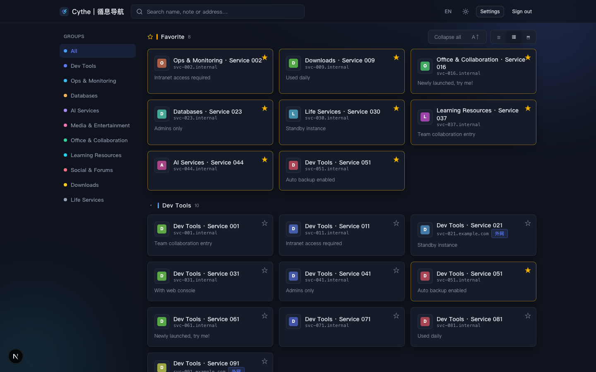

Big-card mode (thumbnail preview area):

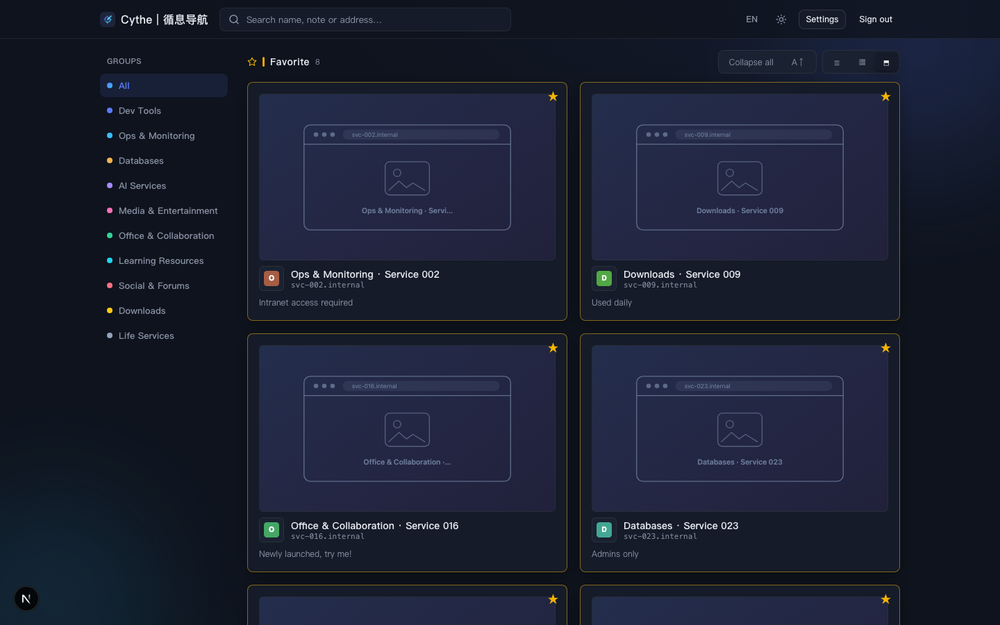

Compact list mode:

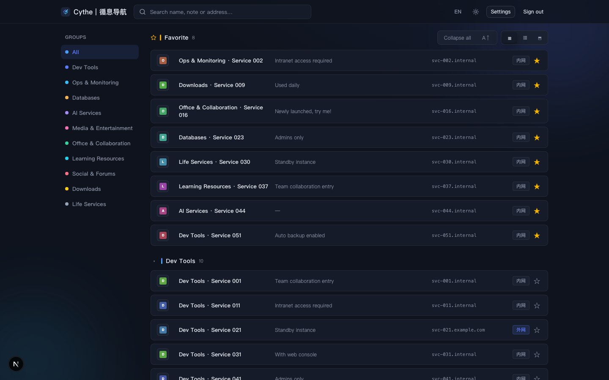

Light theme:

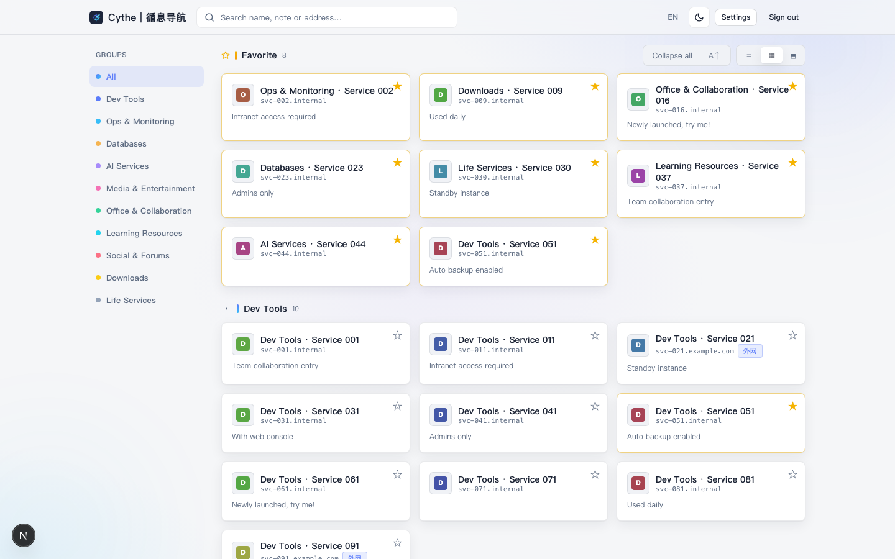

Live search (typing filters to matching groups instantly):

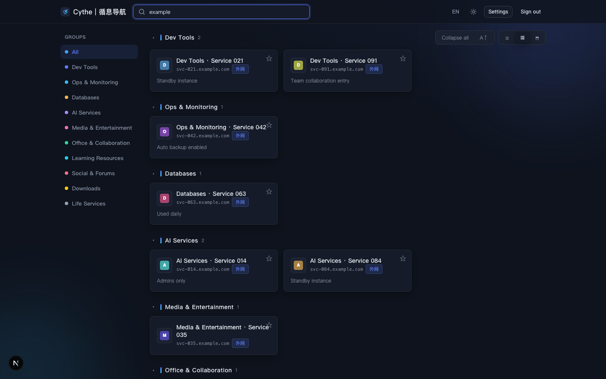

Settings navigation (Sites / Groups / LAN Scan / Appearance / System / Users / Backup, unified SVG icons):

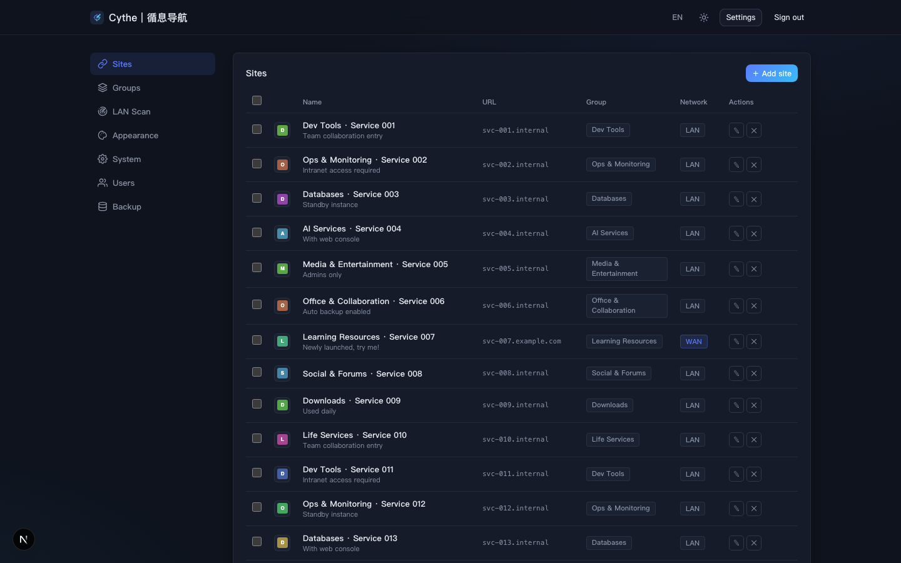

Group management (color / visibility / reorder):

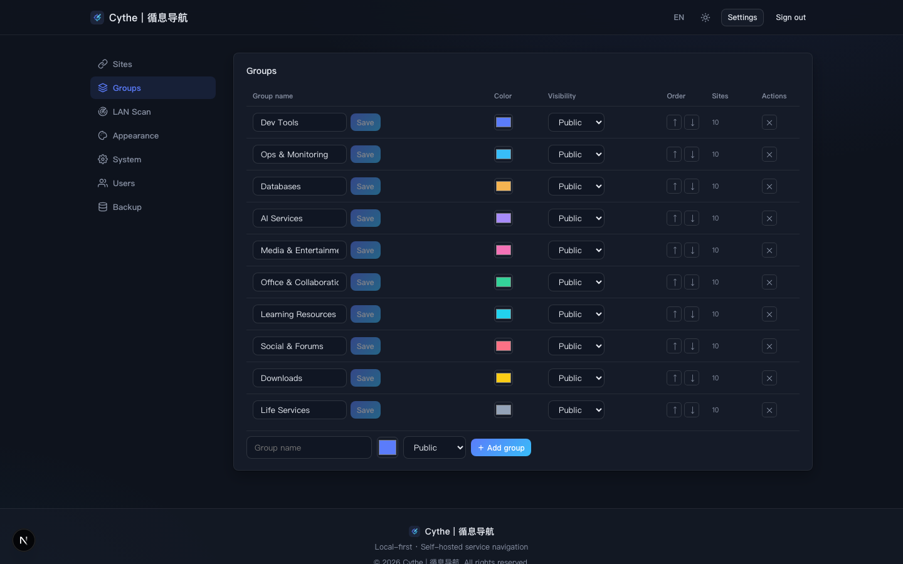

LAN auto-scan (disclose-first design: a numbered notice explains what the scan does and where results go; the scan button stays locked until consent is ticked):

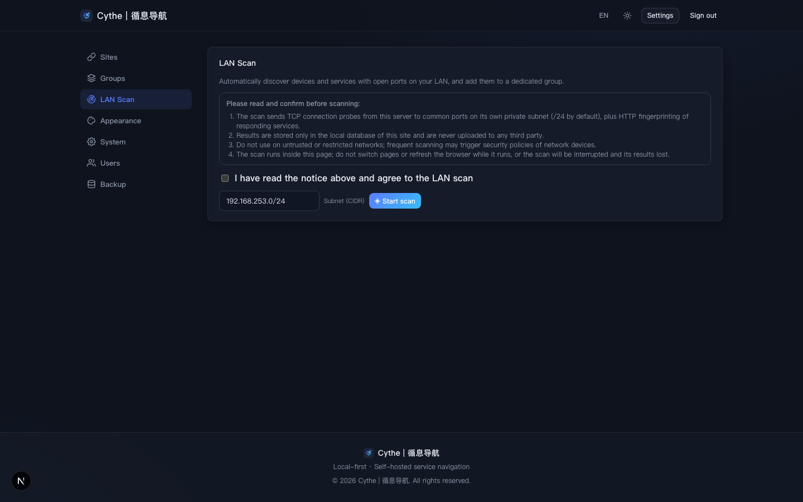

Appearance (mode, accent palette, language, background upload, site logo, default view):

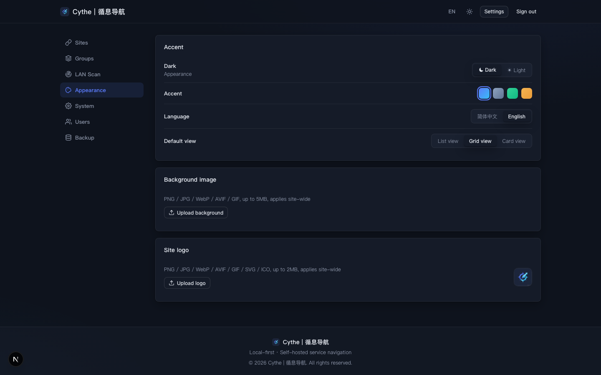

Data backup (JSON export / import):

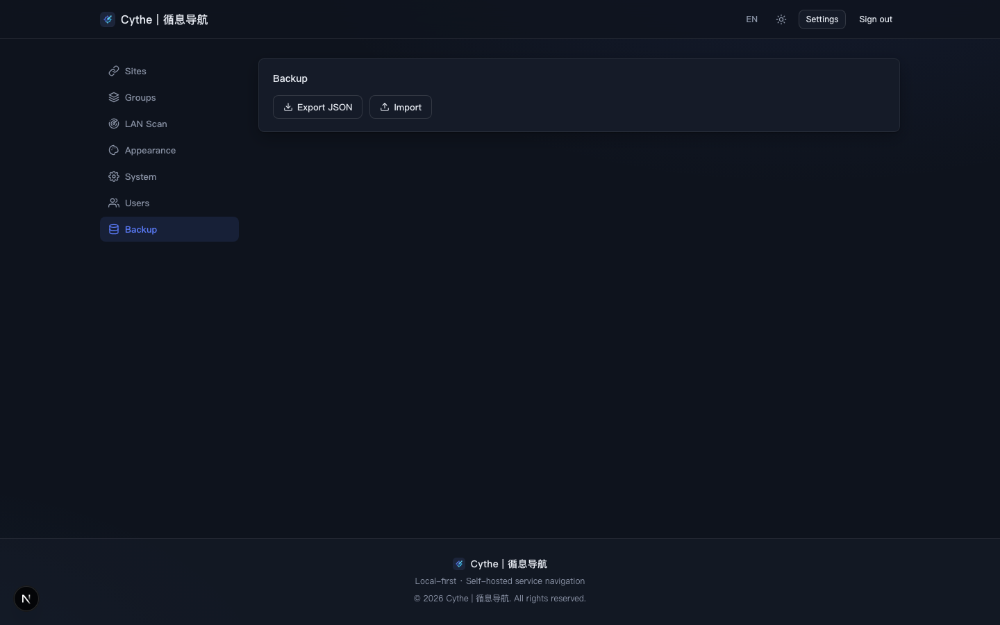

Login / register (first registration becomes admin, with a live hint):

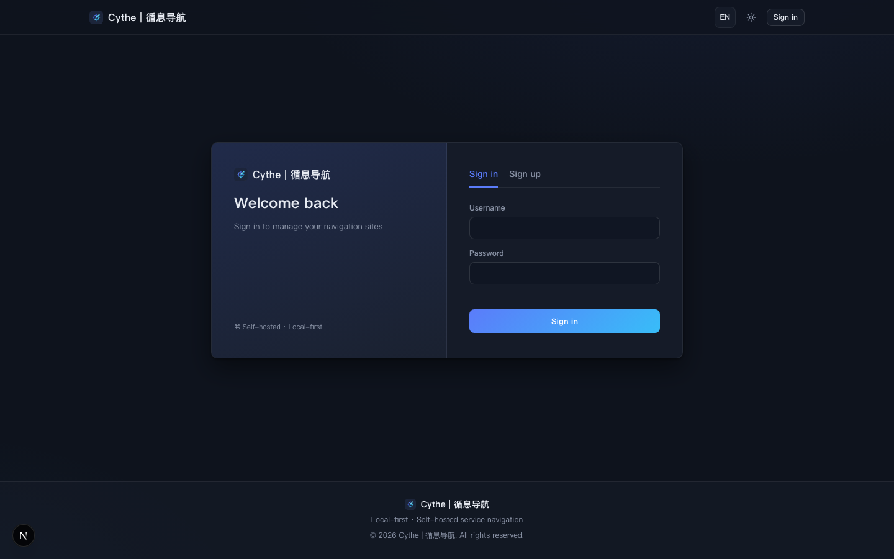

### Mobile (re-laid out below 760px)

Small-screen home: header actions collapse into an icon menu, search folds away, the group sidebar becomes an edge drawer:

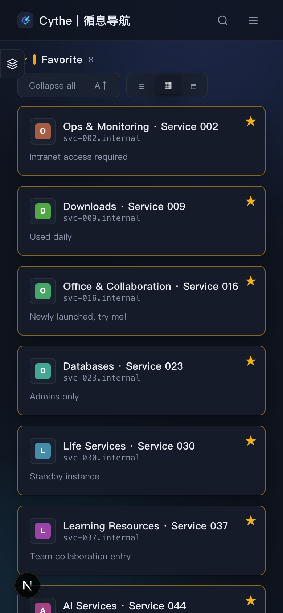

The group drawer slides out from the left edge with a brand row and a translucent mask:

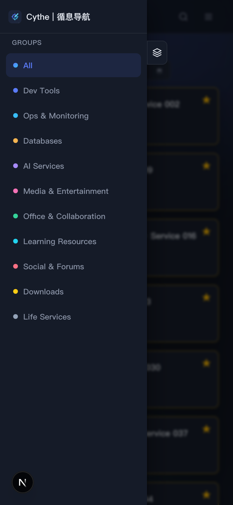

Header icon menu (language / theme / settings / sign out):

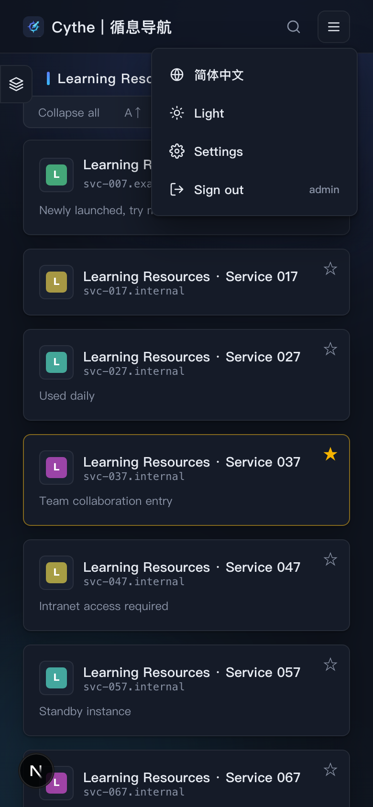

## In Depth

### Navigation

- Link entries: name / URL / note / group / icon / scope tag (`internal` / `external`)
- **Left group sidebar** with color dots; view switcher and collapse controls share the first group's header row. Below 760px the sidebar becomes a slide-out drawer and the toolbar wraps to its own row
- **Favorites group on top**: favorited sites are aggregated into a highlighted cross-group section
- **Three view modes**: compact list, grid cards, big cards (with thumbnails) — switchable anytime and remembered per account
- **Live search** across names, notes, and addresses
- **Drag & drop sorting** persisted to the server; one-click ascending/descending ordering as well
- Group management: custom names, colors, ordering, per-group collapse, and a single button toggling *collapse all / expand all* (state remembered per user)
- **Batch management**: the Sites table supports select-all and per-row checkboxes (indeterminate state when partial), with batch delete or move-to-group in one server-side transaction; entries you don't own are disabled client-side and skipped server-side

### LAN Auto-Scan (with informed consent)

- **Disclose first, scan later**: the settings page spells out exactly what the scan does (TCP probes + HTTP fingerprinting against your private subnet), where results go (local database only), and the risks. The scan button stays locked until the consent checkbox is ticked; the API enforces `consent` too (403 otherwise)
- **Admin-only**, with server-side validation: RFC1918 subnets only (public CIDRs rejected), /16–/30 range, ≤ 120 ports per run
- **Preview before writing**: scanning only probes and lists results; each row has its own checkbox (new findings pre-selected) and nothing is written until you confirm (`POST /api/scan` previews, `POST /api/scan/confirm` writes)
- **Results cached 5 minutes** in `localStorage` — survive tab switches, with re-scan and clear options
- **Interruption guard during scans**: other navigation tabs are temporarily disabled and `beforeunload` is hooked so a stray refresh can't lose results
- **Smart naming**: page titles when available (`MiRouter [192.168.1.20:80]`), TLS certificate subjects for self-signed HTTPS, service names / `Server` headers / addresses composed into the note; non-web protocols get proper schemes (`ssh://`, `redis://`, …) instead of pretending to be web pages
- Everything scanned lands in a dedicated "LAN Scan" group, deduplicated by `host:port`, fully editable like any other entry

### Icons & Thumbnails (the core differentiator)

- **Local favicon discovery**: parses `<link rel="icon">` with `/favicon.ico` fallback, cached by domain MD5 under `data/icons/` — intranet addresses fetched directly, never proxied through Google
- **Real screenshots**: the bundled headless Chromium renders and captures each target into `data/thumbs/<id>.png` — **this works for 192.168.x.x services**, which external screenshot APIs simply cannot reach
- Browser instance reused across requests; graceful degradation if Chromium is unavailable
- Sites without icons fall back to **letter avatars** generated from a name hash — never a broken image
- Big-card mode shows a hand-drawn **SVG placeholder** (browser wireframe + hostname + site name, theme-aware) when a screenshot isn't available

### Multi-user & Permissions

- Username/password registration, bcrypt-hashed, server-side sessions (30 days, HttpOnly cookies), middleware-enforced auth
- **First registration becomes admin** (or preset via environment variables; the register page shows a live hint)
- Admin panel: open/close registration, allow regular users to add links, manage users (create, promote/demote, disable — disabled accounts fail immediately)

### Per-user Preferences (server-side)

Theme mode, accent, language, default view, sort direction, collapsed groups, and **favorites** all live in the database and follow the account — same experience on any device.

### Look & Feel

- Light/dark modes × 4 accent palettes: Indigo / Graphite / Forest / Sand
- Custom site-wide background (PNG / JPG / WebP / AVIF / GIF, ≤ 5MB) for logged-in users
- Custom site logo and title (admin) applied across header, login page, footer, and browser tab instantly
- Micro-animations (card lift, cursor glow, cascading entrances, ambient orbs) — pure CSS, no animation library
- **Fully responsive**: header actions fold into an icon menu, search collapses, sidebars become edge drawers with grab handles, and the Sites table re-renders as per-row cards below 900px — no horizontal overflow anywhere

### Data & Backup

- Single SQLite (WAL) database + local image cache, all under `./data` — migration = copy one directory
- Backup API: JSON export (settings, groups, links); admins import inside a single transaction

## Comparison with Similar Projects

Versus common dashboards / startpage projects (Homer, Dashy, Heimdall, Sun-Panel, etc.):

| Dimension | Cythe | Typical alternatives |
| --- | --- | --- |
| Intranet thumbnails | ✅ Local Chromium screenshots | ❌ External screenshot APIs (can't reach intranet) or absent |
| Fully offline | ✅ Icons / styles resolved locally | ⚠️ Many rely on Google Fonts, favicon.google.com, external APIs |
| Service auto-discovery | ✅ Consent-gated LAN scan into a group | ❌ Hand-edit config.yml / JSON entry by entry |
| Multi-user | ✅ Registration / roles / disabling | ⚠️ Mostly single-user or one global password (e.g., Homer) |
| Per-user prefs & favorites | ✅ Server-side, follows the account | ❌ Browser localStorage or shared globally |
| Private group visibility | ✅ Public / private groups | ❌ Rare; usually one shared dataset |
| Deployment | ✅ One container, one volume | ⚠️ Heimdall needs PHP+MySQL; Dashy suggests Redis |
| Backup & migration | ✅ Copy `data/` or JSON export/import | ⚠️ DB dumps or scattered config files |
| UI language | ✅ zh / en, per account | ⚠️ Usually English only |
| Stack | Next.js 15 + React 19 + TS, unified front/back | Mostly PHP (Heimdall), legacy Vue (Homer), multi-container builds |

**In one sentence**: most similar projects assume "your services live on the public internet" — Cythe assumes from the first line of code that "your services live on *your* intranet": screenshots, icons, auth, and preferences all keep working with zero internet access, while SQLite replaces MySQL/Postgres/Redis to push self-hosting ops cost close to zero.

## Quick Start

### Docker

```bash
docker compose up -d --build
# open http://<host>:3000
```

Environment variables (editable in `docker-compose.yml`):

| Variable | Default | Description |
| --- | --- | --- |
| `CYTHE_HTTP_PORT` | 3000 | Host port |
| `ADMIN_USERNAME` / `ADMIN_PASSWORD` | (empty) | Initial admin; if empty, the first registered user becomes admin |
| `DISABLE_FIRST_ADMIN` | (empty) | Set to `1` to disable "first registered user becomes admin" (use with `ADMIN_*`; recommended for public deployments) |
| `COOKIE_SECURE` | (empty) | Set to `1` to mark the session cookie `Secure`; enable when served behind HTTPS-terminating proxies |
| `TZ` | Asia/Shanghai | Timezone |

State persists under `./data` (`cythe.db`, `icons/`, `thumbs/`).

### 1Panel

1. Upload the whole `1panel/cythe-navigation/` directory to `/opt/1panel/apps/local/`;
2. 1Panel → App Store → Local Apps → Install, filling in the port and parameters;
3. Data persists under the app's own `data/` directory.

> The image is based on `mcr.microsoft.com/playwright` (Chromium bundled) and weighs ~2GB — that's the price of "screenshots that work on your intranet".

### Local Development

```bash
npm install
npm run dev        # http://localhost:3000
# Thumbnails locally: npx playwright-core install chromium-headless-shell
# Inject demo data (100 links / 10 groups): node scripts/seed.mjs  (add --en for English names/notes)
```

## Architecture

```
Next.js 15 (App Router, standalone output)
├── Server Components for first paint (visible data rendered server-side, no flash)
├── API Routes (/api/*) — links / groups / favorites / prefs / users / settings / scan / backup / static assets
├── middleware.ts — single session-auth gate
└── better-sqlite3 (WAL) ── data/cythe.db, a single-file database
    playwright-core ─────── reused headless Chromium for thumbnails
    node:net / node:tls ─── LAN port probing & service fingerprinting (zero extra deps)
    hand-rolled i18n / theming ── no UI framework, pure CSS
```

- Minimal dependencies: only 7 production deps — no component library, no state manager, no CSS framework
- Auth: bcryptjs password hashing + random 32-byte token sessions in HttpOnly cookies
- Visibility filtered server-side (`visible.ts`) — private groups never appear in other users' responses

## Repository Layout

```
├── src/
│   ├── app/            # pages & API routes
│   │   ├── api/        # auth / links (incl. reorder, batch) / groups / favorites / prefs / scan / asset(bg·icon·thumb) / backup / ...
│   │   ├── login | register | settings
│   │   └── page.tsx    # home (server-rendered)
│   ├── components/     # HomeView, editors, dialogs, settings pages, ...
│   ├── lib/            # db / auth / visible / thumb / favicon / scan / i18n / types
│   └── middleware.ts   # auth middleware
├── data/               # runtime state (SQLite + icon/thumb caches)
├── scripts/            # seed.mjs demo data injector
├── docs/screenshots/   # README screenshots
├── 1panel/             # 1Panel local app template
├── Dockerfile          # standalone build on the Playwright base image
└── docker-compose.yml
```

## License

Free for personal / intranet self-hosted use.
