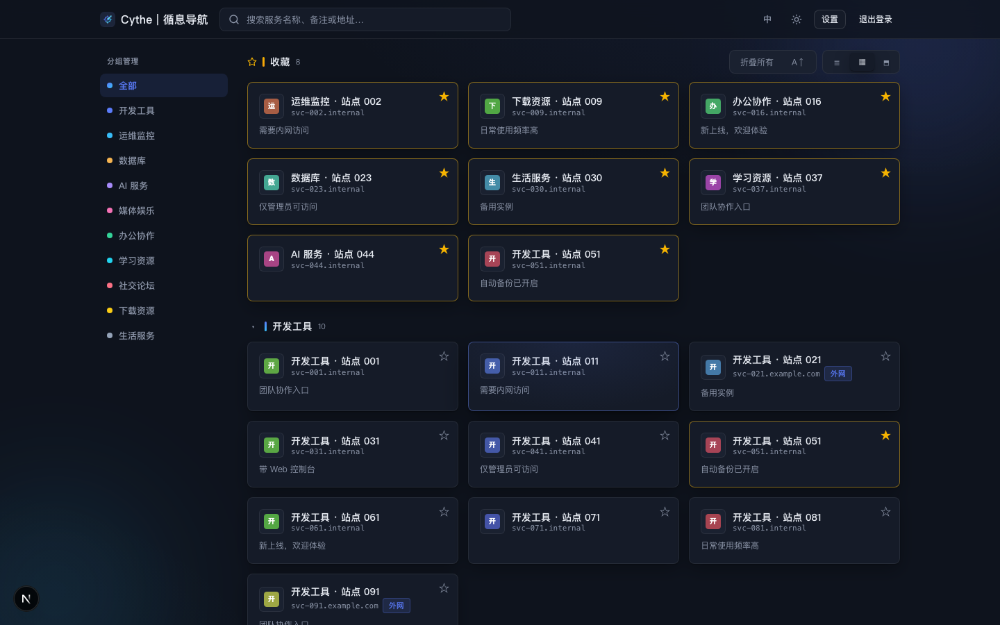
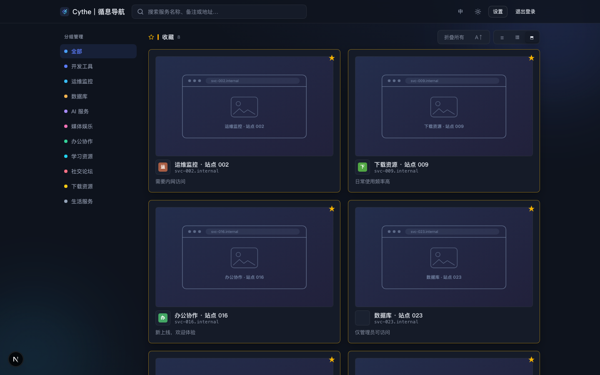
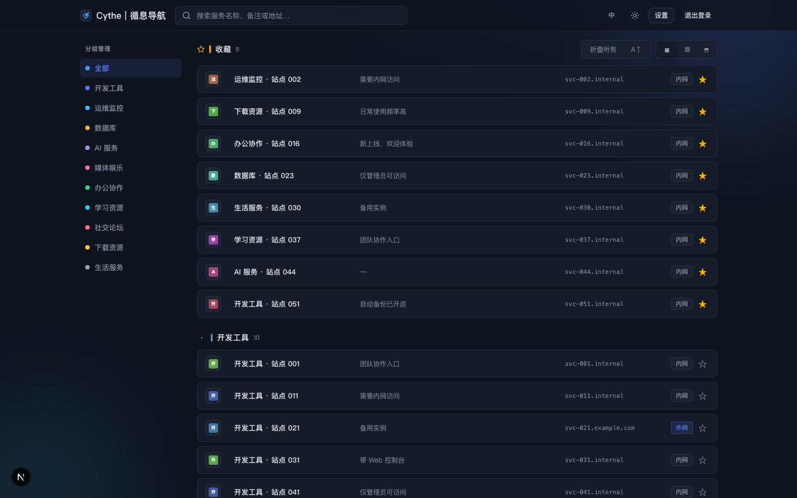
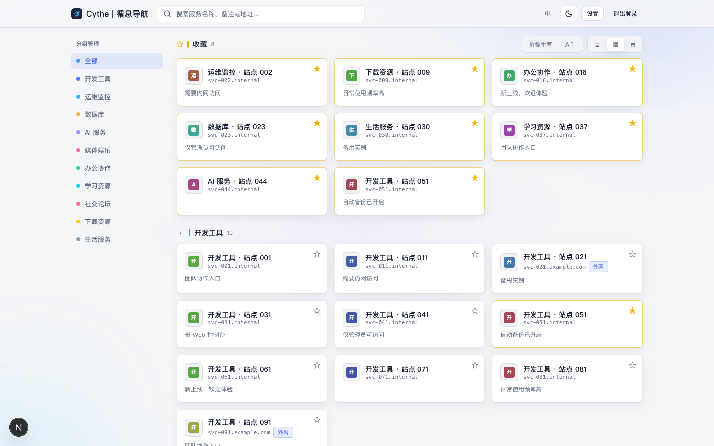
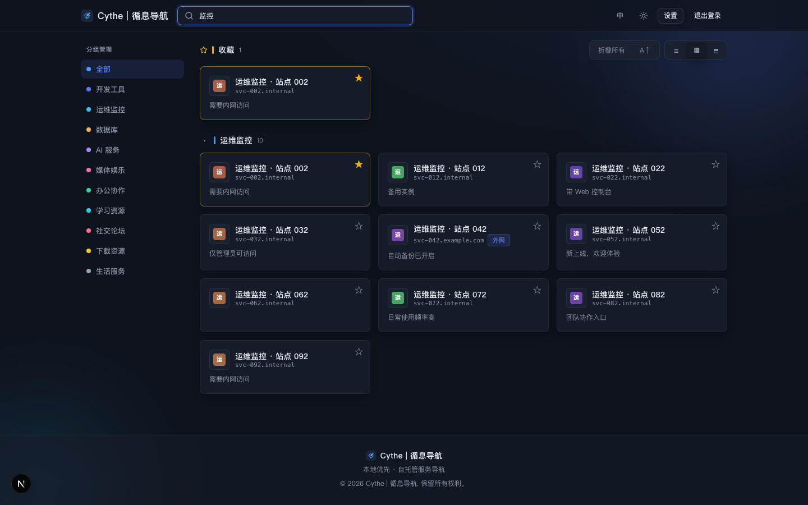
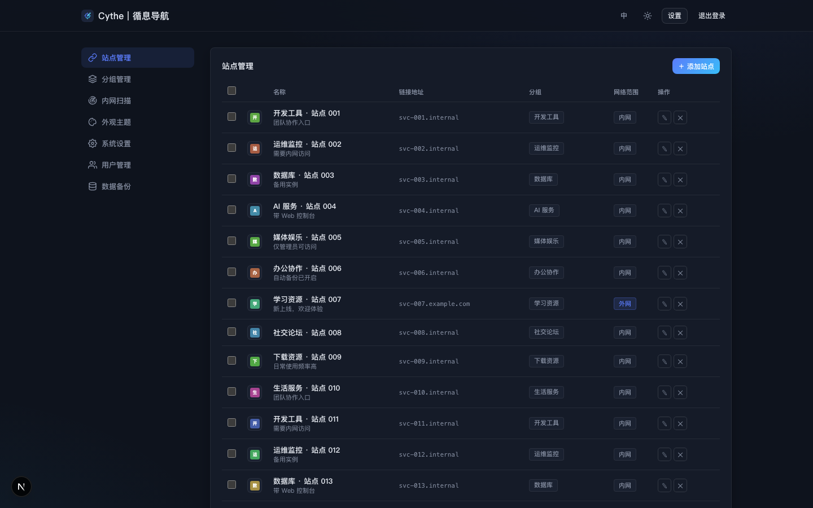
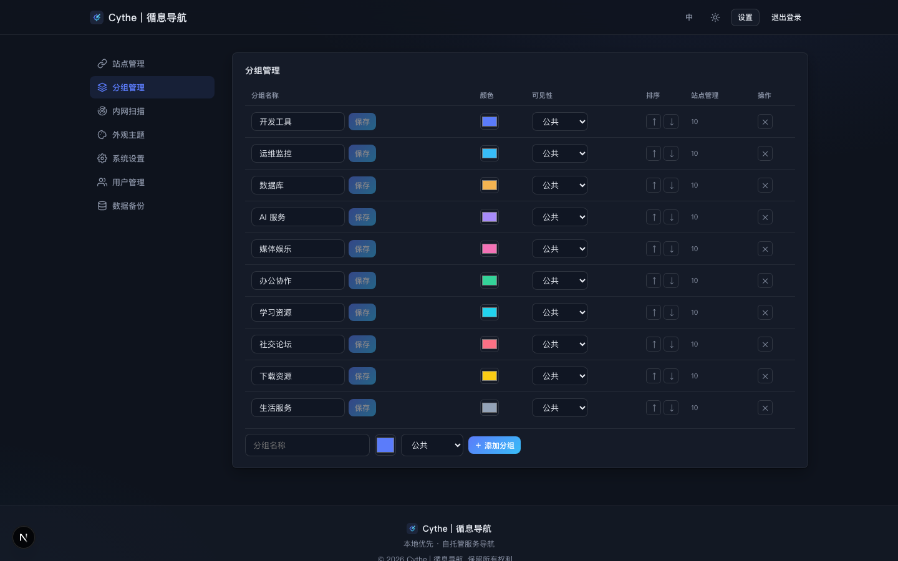
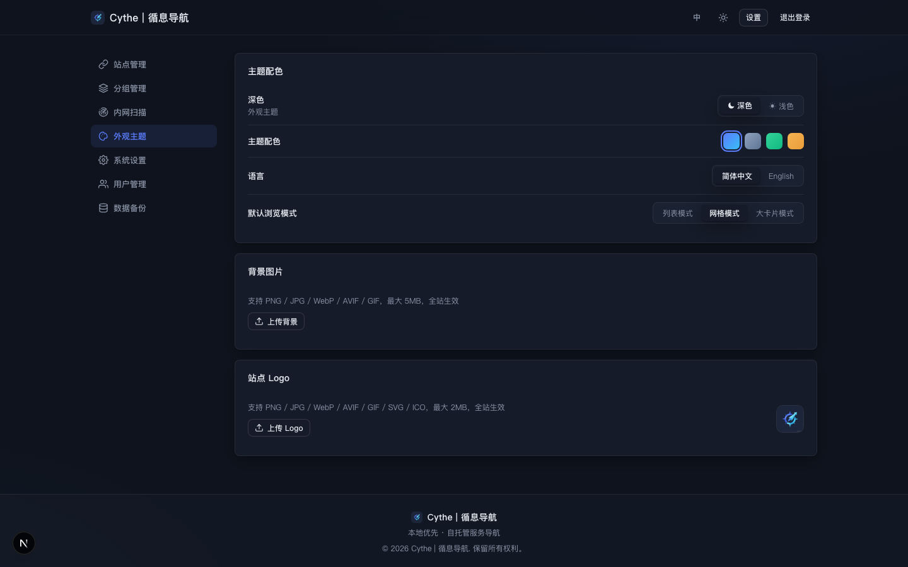
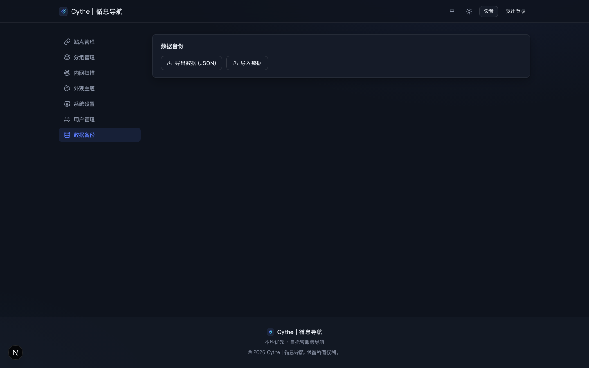
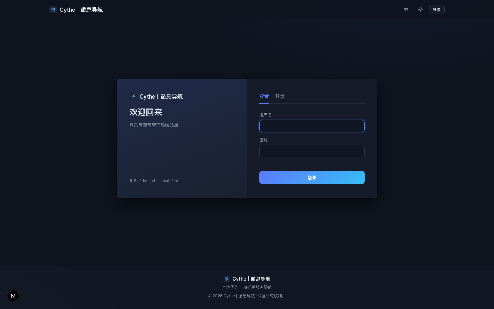

# Cythe 导航 (CytheNavigation)

一个**完全自托管、零外部依赖**的本地服务导航页，为多 NAS / 多服务的内网环境而生。

单个 Docker 容器 + 单个 SQLite 文件即为全部运行时状态，不依赖任何第三方 API、CDN 或云服务——即使内网环境完全没有外网，图标、缩略图、字体回退等核心体验也照常工作。

## 特性一览

| | 特性 | 说明 |
| --- | --- | --- |
| 🖼 | **内网服务缩略图** | 内置 headless Chromium 直接截图，不依赖外部截图服务 |
| 🔌 | **离线可用** | 图标抓取、字体、样式全部本地解析，无外网也能完整运行 |
| 👥 | **多用户体系** | 注册开关、角色权限、用户禁用、每用户独立的偏好与收藏 |
| 🗂 | **分组可见性** | 分组可设为公开 / 私有，私有分组仅所有者与管理员可见 |
| 🎨 | **主题系统** | 深浅双模式 × 4 套高级配色 + 自定义全站背景图 |
| 🌐 | **中英双语** | 简体中文 / English 即时切换，语言偏好跟随账号 |
| 📦 | **单文件持久化** | SQLite（WAL）+ 图片缓存全部落在挂载卷 `./data`，备份即拷目录 |
| ✍ | **JSON 导出 / 导入** | 链接、分组、设置一键导出，管理员可导入恢复 |

## 界面预览

> 以下截图由本地 `npm run dev` 运行、注入示例数据（`node scripts/seed.mjs`）后实拍。

首页 · 网格卡片（深色 / 靛蓝）——左侧竖向分组导航、顶部独立收藏组、右上角视图与折叠控件：



大卡片模式（缩略图预览位）：



紧凑列表模式：



浅色主题：



实时搜索（输入"监控"即时过滤到对应分组）：



后台导航（站点 / 分组 / 外观主题 / 系统设置 / 用户管理 / 数据备份，统一 SVG 图标）：



分组管理（颜色 / 可见性 / 上下移排序）：



外观主题（深浅模式、配色、语言、背景图上传）：



数据备份（JSON 导出 / 导入）：



登录 / 注册（首注册即管理员，带动态提示）：



## 功能详解

### 站点导航

- 链接条目包含：名称 / URL / 备注 / 分组 / 图标 / 内外网标记（`internal` / `external`）
- **左侧分组导航**：分组以竖向侧栏展示在页面左侧（带颜色色标），内容区居右，视图切换与折叠控件位于右上角
- **顶部收藏组**：收藏的站点独立汇总为顶部一组高亮展示（跨分组），与常规分组分区共存
- **三种浏览模式**：紧凑列表、网格卡片、大卡片（带缩略图预览），可随时切换并按账号记忆
- **实时搜索**：按名称、备注、地址模糊匹配，搜索框支持折叠展开两种布局
- **拖拽排序**：卡片直接拖拽换位，顺序持久化到服务端；也支持一键升降序排列
- 分组管理：自定义名称、颜色标识、排序，支持单组折叠与**一个按钮在“折叠所有 / 展开所有”两态间切换**（折叠状态按用户记忆）

### 图标与缩略图（核心差异化能力）

- **图标自动发现**：解析目标页面 `<link rel="icon">` 并逐级回退到 `/favicon.ico`，抓取后按域名 MD5 缓存到 `data/icons/`；对内网地址直连抓取，不经 Google 等第三方服务
- **缩略图自动截图**：利用内置 headless Chromium 对目标 URL 真实渲染截图，存至 `data/thumbs/<id>.png`——**内网 192.168.x.x 的服务同样可以截图**，这是依赖外部截图 API 的同类项目做不到的
- 浏览器实例跨请求复用、异常自动降级，Chromium 不可用时服务整体不受影响
- 无图标站点自动回退为**按名称哈希着色生成的首字母 SVG 图标**，永不出现破图

### 多用户与权限

- 用户名 / 密码注册登录，bcrypt 加盐哈希，服务端 Session（30 天有效期、HttpOnly Cookie），中间件统一鉴权
- **首注册即管理员**：环境变量可预置管理员账号；留空则第一个注册用户自动成为管理员（注册页有动态提示）
- 管理员控制面板：
  - 开放 / 关闭注册开关
  - 普通用户是否允许添加链接的开关
  - 用户管理：添加用户、提权 / 降权、禁用 / 启用账号（被禁用用户立即失效）
- 审计友好：所有写操作 API 均校验角色，导入备份仅限管理员

### 每人一套偏好（服务端存储）

与普通用户相关的状态全部存在数据库中并跟随账号，换设备登录体验一致：

- 主题模式（浅 / 深）、accent 配色、界面语言、默认视图
- 排序方向、分组折叠状态
- **收藏夹**：每个用户独立收藏常用服务，汇总为首页顶部一个独立的收藏分组展示

### 外观与动效

- 深浅双模式 + 4 套高级配色：靛蓝 / 石墨 / 森绿 / 暖砂
- **自定义背景图**：登录用户可上传全站背景（PNG / JPG / WebP / GIF，≤5MB）
- 微动效体系：卡片浮起、鼠标光斑跟随、进场级联动画、背景光球，全部纯 CSS 实现、无动画库依赖
- 完整响应式：移动端搜索栏自动切换为头部折叠模式

### 数据与备份

- SQLite（WAL 模式）单文件数据库 + 本地图片缓存，全部位于 `./data`，数据迁移 = 拷贝一个目录
- 备份 API：JSON 导出（含设置、分组、链接），管理员导入时在事务中整体恢复
- 站点标题、默认视图等设置在线可改，无需重启

## 与同类项目的对比

横向对比常见的本地导航 / Dashboard 项目（Homer、Dashy、Heimdall、Sun-Panel 等）：

| 维度 | Cythe 导航 | 典型同类项目 |
| --- | --- | --- |
| 内网服务缩略图 | ✅ 内置 Chromium 本地截图 | ❌ 依赖外部截图 API（无法访问内网）或无此功能 |
| 完全离线运行 | ✅ 图标 / 样式全部本地处理 | ⚠️ 多数依赖 Google Fonts、favicon.google.com、外部 API |
| 多用户 | ✅ 注册 / 角色 / 禁用 / 用户管理 | ⚠️ 普遍单用户或仅基础密码保护（如 Homer 仅全局口令） |
| 每用户偏好与收藏 | ✅ 服务端跟随账号 | ❌ 多为浏览器 localStorage 或全站共享 |
| 分组私有可见性 | ✅ 公开 / 私有分组 | ❌ 少见，通常全站同一片数据 |
| 部署复杂度 | ✅ 单容器，挂一个卷 | ⚠️ Heimdall 需 PHP+MySQL；Dashy 建议配 Redis / 多服务 |
| 备份迁移 | ✅ 拷 `data/` 目录或 JSON 导出导入 | ⚠️ 依赖数据库 dump 或多处配置文件 |
| 界面语言 | ✅ 中 / 英双语，跟随账号 | ⚠️ 多为固定英文 |
| 技术栈 | Next.js 15 + React 19 + TS，前后端一体 | 多为 PHP（Heimdall）、Vue 旧版（Homer）、需构建多容器 |

**一句话总结**：同类项目大多假设"服务都在公网上"，而 Cythe 从第一行代码就假设"服务都在你的内网里"——截图、图标、鉴权、偏好在纯内网、零外网的环境下全部照常工作；同时用 SQLite 换掉了 MySQL/Postgres/Redis，把自托管的运维成本压到接近于零。

## 快速开始

### Docker 部署

```bash
docker compose up -d --build
# 访问 http://<host>:3000
```

环境变量（可在 `docker-compose.yml` 中修改）：

| 变量 | 默认 | 说明 |
| --- | --- | --- |
| `CYTHE_HTTP_PORT` | 3000 | 对外端口 |
| `ADMIN_USERNAME` / `ADMIN_PASSWORD` | (空) | 初始管理员；留空则第一个注册用户成为管理员 |
| `TZ` | Asia/Shanghai | 时区 |

数据持久化在 `./data`（含 `cythe.db`、`icons/`、`thumbs/`）。

### 1Panel 部署

1. 将 `1panel/cythe-navigation/` 整个目录上传到 `/opt/1panel/apps/local/`；
2. 1Panel → 应用商店 → 本地应用 → 安装，按表单填端口等参数；
3. 数据自动持久化到应用目录下 `data/`。

> 镜像基于 `mcr.microsoft.com/playwright`（内置 Chromium），约 2GB 属正常，这是"内网可截图"能力的代价。

### 本地开发

```bash
npm install
npm run dev        # http://localhost:3000
# 本地缩略图功能需: npx playwright-core install chromium-headless-shell
# 注入示例数据（100 个站点 / 10 个分组，便于预览）: node scripts/seed.mjs
```

## 技术架构

```
Next.js 15 (App Router, standalone 输出)
├── Server Components 首屏直出（服务端渲染可见数据，无加载闪烁）
├── API Routes（/api/*）—— 链接 / 分组 / 收藏 / 偏好 / 用户 / 设置 / 备份 / 静态资源
├── middleware.ts —— 统一 Session 鉴权
└── better-sqlite3（WAL）── data/cythe.db 单文件数据库
    playwright-core ──── 复用无头 Chromium 渲染缩略图
    自研 i18n / 主题层 ── 零 UI 框架依赖，纯手写 CSS
```

- 依赖极简：运行时仅 7 个生产依赖，无 UI 组件库、无状态管理库、无 CSS 框架
- 鉴权：bcryptjs 口令哈希 + 随机 32 字节 token 会话，HttpOnly Cookie
- 数据可见性在服务端过滤（`visible.ts`），私有分组不会出现在他人响应中

## 目录结构

```
├── src/
│   ├── app/            # 页面与 API 路由
│   │   ├── api/        # auth / links(含 reorder) / groups / favorites / prefs / asset(bg·icon·thumb) / backup / ...
│   │   ├── login | register | settings
│   │   └── page.tsx    # 首页（服务端渲染）
│   ├── components/     # HomeView、编辑器、对话框、设置页等
│   ├── lib/            # db / auth / visible / thumb / favicon / i18n / types
│   └── middleware.ts   # 鉴权中间件
├── data/               # 运行时状态（SQLite + 图标/缩略图缓存）
├── scripts/            # seed.mjs 示例数据注入
├── docs/screenshots/   # README 界面截图
├── 1panel/             # 1Panel 本地应用模板
├── Dockerfile          # 基于 playwright 镜像的 standalone 部署
└── docker-compose.yml
```

## License

个人 / 内网自托管场景随意使用。
